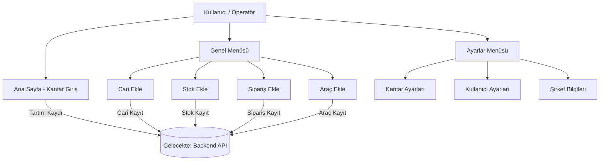

# 🏗️ Kantar Otomasyonu

**Dursunoğlu Demir Çelik A.Ş.** için geliştirilmiş, araç tartım süreçlerini dijitalleştiren web tabanlı kantar otomasyon arayüzü.

---

## 📋 Proje Hakkında

Bu proje, demir-çelik sektöründe faaliyet gösteren Dursunoğlu Demir Çelik A.Ş.'nin kantar (baskül/tartı) operasyonlarını yönetmek için tasarlanmış bir **frontend web uygulamasıdır**.

Araç giriş/çıkış tartım süreçlerini, müşteri (cari) kayıtlarını, stok tanımlarını, sipariş takibini ve araç bilgilerini tek bir arayüzden yönetmeye olanak tanır.

---

## ✅ Özellikler

| Özellik | Açıklama |
|---------|---------|
| 🚛 **Kantar Bilgi Girişi** | Plaka, cari, stok, sipariş, sürücü, irsaliye no, tartım tipi, fiyat ve fire girişi |
| ⚖️ **Tartım Takibi** | 1. tartım, 2. tartım ve net tartım görüntüleme |
| 👥 **Cari Yönetimi** | Müşteri/firma kaydı (bireysel ve kurumsal) |
| 📦 **Stok Tanımları** | Stok kodu, adı ve açıklama kaydı |
| 📋 **Sipariş Takibi** | Sipariş numarası, miktar, fiyat ve KDV hesabı |
| 🚗 **Araç Kayıtları** | Şoför bilgisi, araç/çekici plakası, ruhsat numarası |
| ⚙️ **Kantar Ayarları** | Seri port (COM/USB), data bits ve baud rate konfigürasyonu |
| 👤 **Kullanıcı Yönetimi** | Kullanıcı adı, şifre ve rol bazlı yetkilendirme |
| 🏢 **Şirket Bilgileri** | Firma adı, vergi dairesi, adres bilgileri |

---

## 🛠️ Teknolojiler

```
Frontend:
  - HTML5 (semantik yapı)
  - Vanilla CSS (özel stil)
  - Vanilla JavaScript (ES6+)

CSS Framework:
  - Bootstrap 5.3.0

JavaScript Kütüphaneleri:
  - jQuery 3.7.0
  - Popper.js
  - Swiper (slayt bileşeni)
  - FancyBox 2.1.5

İkon Kütüphanesi:
  - FontAwesome 6.4.0

Backend:
  - Yok (saf frontend — form verileri sayfa üzerinde gösterilmektedir)

Veritabanı:
  - Yok

Deployment:
  - FTP
```

---

## 📁 Proje Yapısı

```
kantar-otomasyonu/
│
├── index.html                      # Ana Sayfa — Kantar Bilgi Giriş Formu
│
├── pages/                          # Uygulama sayfaları
│   ├── cari-ekle.html              # Müşteri/firma kaydı
│   ├── stok-ekle.html              # Stok tanımı
│   ├── siparis-ekle.html           # Sipariş oluşturma
│   ├── arac-ekle.html              # Araç ve şoför kaydı
│   ├── kantar-ayarlari.html        # Kantar cihazı ayarları (COM port vb.)
│   ├── kullanici-ayarlari.html     # Kullanıcı ve yetkilendirme
│   └── sirket-bilgileri.html       # Şirket bilgileri
│
├── assets/
│   ├── css/
│   │   ├── style.css               # Özel stil dosyası
│   │   └── libs/                   # Vendor CSS kütüphaneleri
│   │       ├── bootstrap.min.css
│   │       ├── fontawesome.min.css
│   │       ├── swiper-bundle.min.css
│   │       └── fancybox.min.css
│   ├── js/
│   │   ├── weighbridge-form.js     # Kantar ana formu
│   │   ├── customer-form.js        # Cari ekle formu
│   │   ├── stock-form.js           # Stok ekle formu
│   │   ├── order-form.js           # Sipariş ekle formu
│   │   ├── vehicle-form.js         # Araç ekle formu
│   │   ├── company-form.js         # Şirket bilgileri formu
│   │   └── libs/                   # Vendor JS kütüphaneleri
│   │       ├── jquery.min.js
│   │       ├── bootstrap.min.js
│   │       ├── popper.min.js
│   │       ├── swiper-bundle.min.js
│   │       ├── fontawesome.min.js
│   │       └── fancybox.min.js
│   └── images/                     # Görseller ve ikonlar
│
├── .gitignore                      # Git ignore kuralları
├── README.md                       # Bu dosya
└── LICENSE                         # MIT Lisansı
```

---

## 🚀 Kurulum

Bu proje saf HTML/CSS/JS ile geliştirildiği için kurulum gerektirmez. Doğrudan tarayıcıda açılabilir.

### Yerel Geliştirme

```bash
# Projeyi klonla
git clone https://github.com/KULLANICI_ADI/kantar-otomasyonu.git

# Proje klasörüne gir
cd kantar-otomasyonu
```

Ardından `index.html` dosyasını bir tarayıcıda aç **veya** VS Code [Live Server](https://marketplace.visualstudio.com/items?itemName=ritwickdey.LiveServer) eklentisini kullan.


## 🔧 Kullanım

### Ana Sayfa — Kantar Bilgi Girişi

1. `index.html` sayfasını aç
2. Sol formu doldur: Plaka, Cari, Stok, Sipariş, Sürücü Adı, İrsaliye No, Tartım Tipi, Fiyat, Fire, TC No, Tel No, Depo
3. Sağ panelde 1. Tartım ve 2. Tartım değerlerini gir
4. **Kaydet** butonuna bas

### Genel İşlemler (Menü → Genel)

| Sayfa | İşlev |
|-------|-------|
| Cari Ekle | Yeni müşteri/firma kaydı oluştur |
| Stok Ekle | Yeni stok tanımı ekle |
| Sipariş Ekle | Sipariş oluştur, KDV ile toplam hesapla |
| Araç Ekle | Araç plakası ve şoför bilgisi kaydet |

### Ayarlar (Menü → Ayarlar)

| Sayfa | İşlev |
|-------|-------|
| Kantar Ayarları | COM port, Baud Rate, Data Bits ayarla |
| Kullanıcı Ayarları | Kullanıcı ekle, rol ata (Admin, Standart vb.) |
| Diğer Tanımlar | Şirket bilgilerini güncelle |

---

## 🏗️ Mimari



> **Not:** Mevcut versiyon saf frontend'dir. Form verileri sayfa yenilendiğinde kaybolur. Backend entegrasyonu için gelecekteki geliştirme planına bakın.

---

